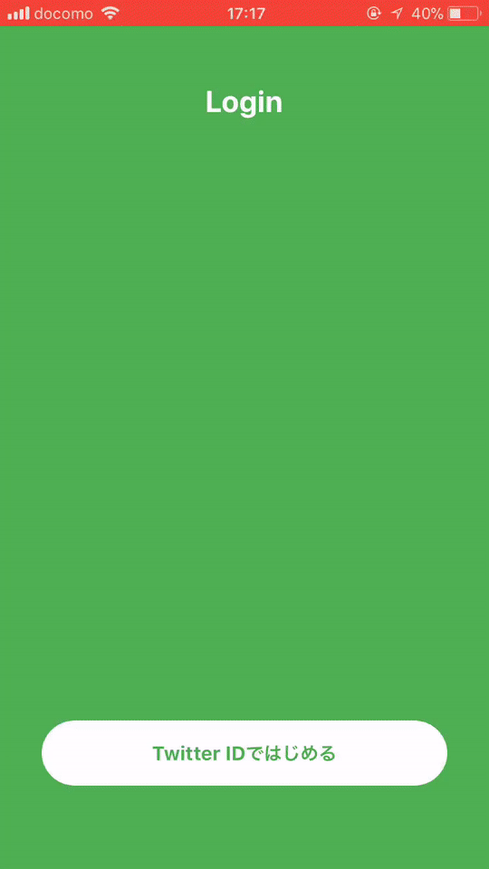

# React-Native-Simple-Twitter
Twitter API client for React Native.  
This client not use NativeModule, only pure javascript.  
So this don't use `react-native link` and [Expo](https://expo.io) can also easily use twitter API without auth0 and server.  
  
And also offer login button,so that is easily login twitter.  
Button is customizable, and including login webview.  
  
Checkout [Usage](#usage).

## Installation
```bash
npm install react-native-simple-twitter --save
```

## Features
* Not use NativeModules, only pure javascript
* Simple API client
* Just put a button to login
* Customizable login button
* Compatible with SafeAreaView

## Demo



## Usage
```js
import React from 'react'
import {
  View,
  Text,
  Alert,
  StyleSheet
} from 'react-native'
import { NavigationActions } from 'react-navigation'
import { connect } from 'react-redux'
import { Constants } from 'expo'

/* import twitter */
import twitter, { TWLoginButton } from 'react-native-simple-twitter'

@connect(
  state => ({
    user: state.user
  })
)
export default class LoginScreen extends React.Component {
  static navigationOptions = ({ navigation }) => {
    const { state, setParams } = navigation
    const { params = {} } = navigation.state

    return {
      header: null
    }
  }

  constructor(props) {
    super(props)

    this.state = {
      isVisible: false,
      authUrl: null
    }
  }

  async componentWillMount() {
    if (this.props.user.token) {
      twitter.setAccessToken(this.props.user.token, this.props.user.token_secret)

      try {
        const user = await twitter.get("account/verify_credentials.json", { include_entities: false, skip_status: true, include_email: true })
        this.props.dispatch({ type: "USER_SET", user: user })

        this.props.dispatch(NavigationActions.reset({
          index: 0,
          actions: [
            NavigationActions.navigate({ routeName: 'Home' })
          ]
        }))
      } catch (err) {
        console.log(err)
      }
    }
  }

  onGetAccessToken = ({ oauth_token, oauth_token_secret }) => {
    this.props.dispatch({ type: "TOKEN_SET", token: oauth_token, token_secret: oauth_token_secret })
  }

  onSuccess = (user) => {
    this.props.dispatch({ type: "USER_SET", user: user })

    Alert.alert(
      "Success",
      "ログインできました",
      [
        {
          text: 'Go HomeScreen',
          onPress: () => {
            this.props.dispatch(NavigationActions.reset({
              index: 0,
              actions: [
                NavigationActions.navigate({ routeName: 'Home' })
              ]
            }))
          }
        }
      ]
    )
  }

  onClose = (e) => {
    console.log("press close button")
  }

  onError = (err) => {
    console.log(err)
  }

  render() {
    return (
      <View style={styles.container}>
        <View style={styles.title}>
          <Text style={styles.titleText}>Login</Text>
        </View>
        <TWLoginButton headerColor={Constants.manifest.primaryColor}
          containerStyle={styles.loginContainer}
          style={styles.loginButton}
          textStyle={styles.loginButtonText}
          onGetAccessToken={this.onGetAccessToken}
          onSuccess={this.onSuccess}
          closeText="閉じる"
          closeTextStyle={styles.loginCloseText}
          onClose={this.onClose}
          onError={this.onError}>Twitter IDではじめる</TWLoginButton>
      </View>
    )
  }
}

const styles = StyleSheet.create({
  container: {
    flex: 1,
    backgroundColor: Constants.manifest.primaryColor
  },
  title: {
    flex: 1,
    padding: 64
  },
  titleText: {
    textAlign: "center",
    fontSize: 24,
    color: "#fff",
    fontWeight: "bold"
  },
  loginContainer: {
    paddingHorizontal: 32,
    marginBottom: 64,
    backgroundColor: "transparent"
  },
  loginButton: {
    backgroundColor: "#fff",
    paddingVertical: 16,
    borderRadius: 64,
    overflow: "hidden"
  },
  loginButtonText: {
    color: Constants.manifest.primaryColor,
    fontSize: 16,
    fontWeight: "bold",
    textAlign: "center"
  },
  loginCloseText: {
    color: "#fff",
    fontWeight: "bold"
  }
})
```
Checkout [example](example).

## TWLoginButton props

| Name | Type| Default | Description |
| --- | --- | --- | --- |
| children | string | 'Login with Twitter' | Login button text |
| callbackUrl | string | null | Twitter application callback url |
| style | any | null | Login button style |
| containerStyle | any | null | Login button's container style |
| textStyle | any | null | Login button's text style |
| headerColor | string | '#efefef' | Webview's modal and SafeAreaView backgroundColor |
| headerStyle | any | null | Webview's header style |
| closeStyle | any | null | Webview close button style |
| closeText | string | 'close' | Webview close button text |
| closeTextStyle | any | null | Webview close button text style |
| onGetAccessToken | func | ({oauth_token,oauth_token_secret}) => {} | Called when get access token |
| onClose | func | () => {} | Called when press close button |
| onSuccess | func | (user) => {} | Called when logged in and get user account |
| onError | func | (e) => {} | Called when on error |

## Client API

* `twitter.setConsumerKey(consumer_key,consumer_key_secret)` - set application key and secret.
* `twitter.setAccessToken(access_token,access_token_secret)` - set user access_token and access_token_secret, when you already have access_token and access_token_secret.
* `twitter.getLoginUrl(callback_url)` - get login url for authorize app.
* `twitter.getAccessToken(oauth_verifier)` - get access_token and access_token_secret, when user logged in app.
* `twitter.api(method,endpoint,parameters)` - call twitter api.
* `twitter.get(endpoint,parameters)` - call twitter get api.
* `twitter.post(endpoint,parameters)` - call twitter post api.

## Other API

* decodeHTMLEntities
```js
import { decodeHTMLEntities } from 'react-native-simple-twitter'

console.log(decodeHTMLEntities("&amp; &apos; &#x27; &#x2F; &#39; &#47; &lt; &gt; &nbsp; &quot;"))
```
Tweet is include htmlencoded characters.  
So this function decode special characters.

* getRelativeTime
```js
import { getRelativeTime } from 'react-native-simple-twitter'

console.log(getRelativeTime(new Date(new Date().getTime() - 32390)))
console.log(getRelativeTime("Thu Apr 06 15:28:43 +0000 2017"))
```
Tweet created_at convert to relative time.
ex) 1s 15m 23h